# GUI Guide
The GUI is by far the most complex aspect of the project since it meticulously transforms the data into summary stats, insightful tables and intriguing graphs. It goes a step further by providing data exportation facilities for external viewing and analysis.

Note: it is assumed compatibility is met and setup is done. Also, you must run the scraping script and obtain at least one records snapshot before using the GUI, which will only run once a snapshot is available.

To launch the GUI, run the `src/gui/main.py` file and if successful, the following screen should appear.
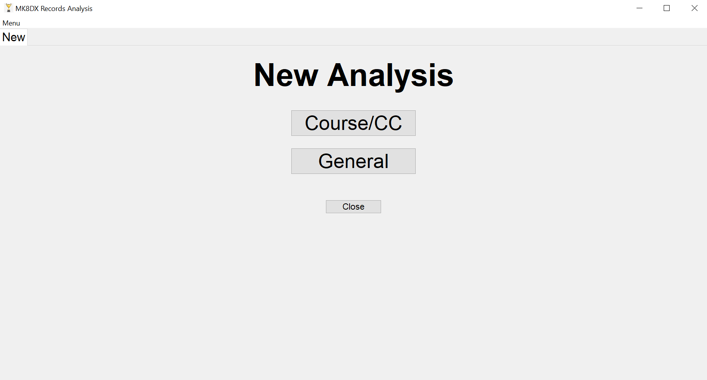

## Tabs
The GUI operates on tabs, where each tab allows for data analysis to take place.
- To create a new tab, simply open the menu and click on 'New Analysis', or alternatively, use the Ctrl+N keybind.
- If a 'New' tab already exists, another new tab cannot be created as it would be pointless.
- Up to 10 analysis tabs can be created (a sensible limit).

If you are unsure about what this means, read on to find out more on how the analysis system works.

## Modes of Analysis
There are two modes of analysis in the program, as you may have noticed:
- **Course/CC** - it is possible to analyse the records of a particular course/CC combination. For example, it is possible to explore Mario Kart Stadium 150cc records or Wii Rainbow Road 200cc records, and any other course/CC combination.
- **General** - it is possible to mass-analyse all 150cc records, all 200cc records, or even all 150cc and 200cc records together, forming insights on the most prominent record holders and builds.

A guide on both modes of analysis follows.

## Course/CC Analysis
To begin course/CC analysis, ensure a New tab is open and press the 'Course/CC' button. The following screen appears:
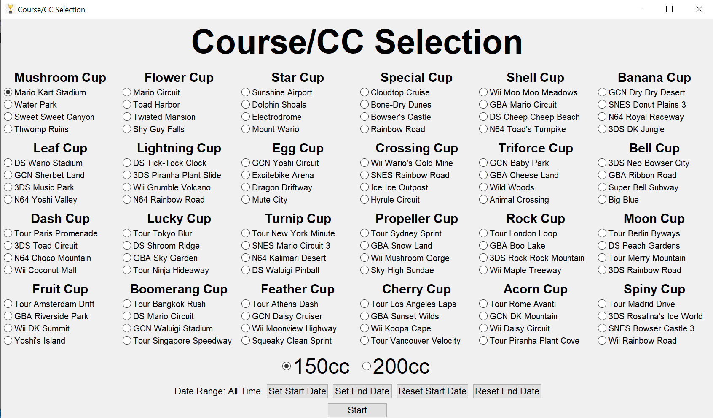

The courses have been grouped into their **corresponding cups** for convenience. Select the course you would like to analyse and the corresponding CC to analyse.

### Date Range
Near the bottom is another interesting option - the **date range**. By default, all records are considered from the first to the current. However, if you would like to take the analysis a step further, you are free to set the start and end date of records to analyse.

Upon clicking on 'Set Start Date' the following toplevel appears:
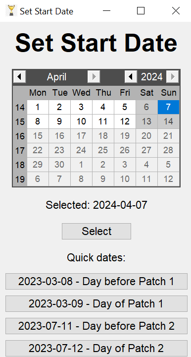

You can select the date using the calendar widget (pressing 'Select' when done) or use one of the **quick dates** if they are what they need. The quick dates are some of the most likely dates that may be used since they are pivotal points where stat changes have occurred (**patches**). Analysis of records before or after a patch might be interesting.

Further note:
- The start date must not be later than the end date.
- The 'Reset Start Date' button resets the start date such that there is no lower date bound.
- The 'Reset End Date' button resets the end date such that there is no upper date bound.

### Starting the Analysis
Once the desired course/CC has been selected, and optionally, a date range, press 'Start' and a screen like so should appear based on your selection:
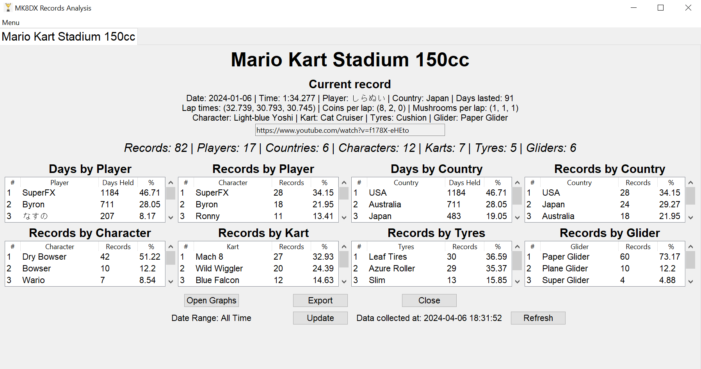

### Analysis Screen
The course/CC analysis screen has the following features:
- Information about the **current record** (or records, in case of a tie). Note, if there is a 3-way tie or more, there is not enough space so the records will not be displayed, although this is extremely rare.
- **Summary stats** - number of records and number of unique players, countries, characters, karts, tyres and gliders the records involve.
- Many **rank tables** (highest to lowest in each case):
    - Days by Player - number of days a player has held the record for the course/CC.
    - Records by Player - number of records a player has achieved for the course/CC.
    - Days by Country - number of days a player of a given country has held the record.
    - Records by Country - number of records a player of a given country has achieved.
    - Records by Character - number of records by character.
    - Records by Tyres - number of records by tyres.
    - Records by Glider - number of records by glider.
- Information on the current date range and the date/time of the snapshot in UTC.
- A button to open graphs (covered in a moment).
- A button to export data (covered in a moment).
- A button to update the date range to analyse.
- A button to refresh the data if a new snapshot has just been generated through the scraping script.
- A button to close the analysis tab.

Have a play around with the buttons if you are still unsure of how they work.

### Graphs
Upon pressing 'Open Graphs', relevant graphs will be displayed as simple images, such as:
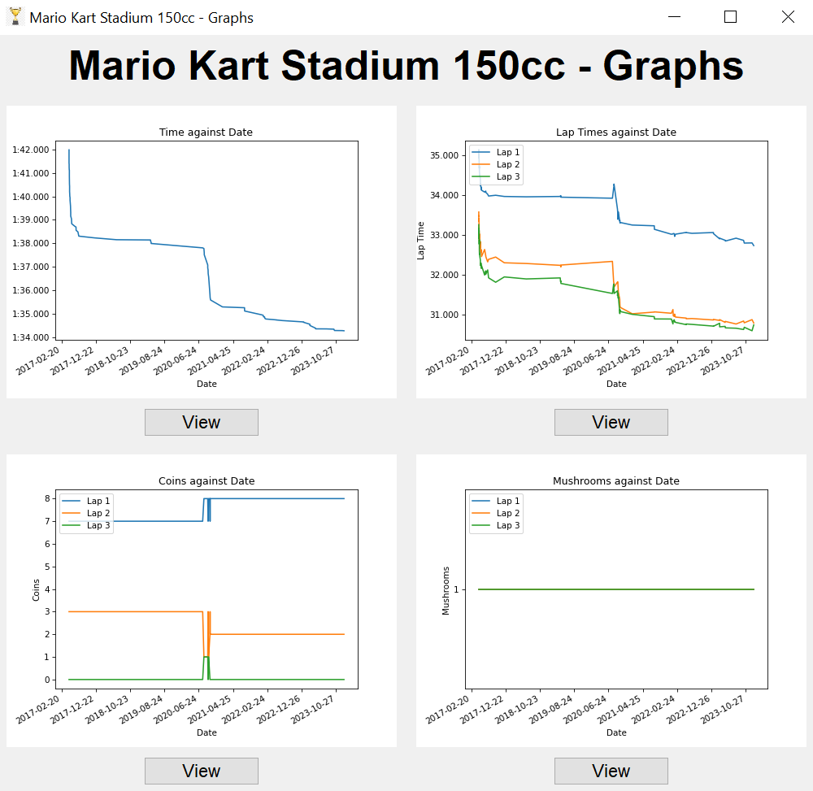

The available graphs are:
-  **Time against Date** - the finish time by date (descending as the best performance improves).
- **Lap Time against Date** - the time taken to complete each lap by date (generally descending).
- **Coins against Date** - the number of coins per lap by date (normally quite stable over time, but strategy changes may affect this).
- **Mushrooms against Date** - ther number of mushrooms per lap (normally very stable over time, but occasionally new strategies may change this).

Further note:
-  The 'View' button below each graph can be pressed to open the graph in **interactive mode** and explore it in greater detail.
- If a line seems to not appear on a graph, this means another line has taken its place. Do not worry about it. Hence, in the example above, the fact Mushrooms against Date has a straight green line of 1 mushroom in lap 3 also indicates 1 mushroom was used in both laps 1 and 2.
- Graphs may not be displayed due to insufficent data - which will only happen within tiny date ranges.

### Exportation
Data exportation is achievable in the program since performing proper analysis in the GUI is admittedly unviable. Upon pressing the 'Export' button, the follow screen appears.
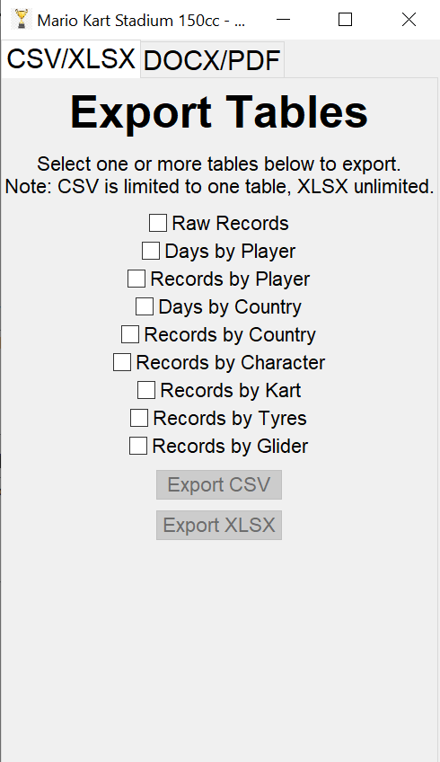

Here, the option to export data in tabular form is available, either as a **CSV**, or more powerfully, a **XLSX** (Excel) file.

- The corresponding tables in the GUI can be exported as required.
- Also, the **raw records** can be exported - which consists of the records of the course/CC and date range.
- Simply select the tables to export.
- Export as CSV or XLSX as desired.
- As indicated, since CSV does not have the concept of sheets, CSVs are limited to exporting **one** table only. If you wish to export multiple tables at once, export to XLSX, where each table will be put into a separate sheet.

You can also export the data in a document form, best for sharing the data for general viewing.
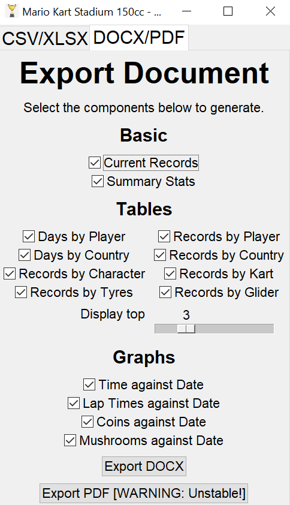

The document includes various parts that can be excluded if desired.
- **Current Records** - this refers to including information on the current record(s) for the course/CC in the document.
- **Summary Stats** - number of records, unique players, karts etc.
- The **tables** in the GUI are included. However, since it is impractical to generate a document with full tables (some tables can have dozens of rows), only the **top N rows** will be included, as seen in the 'Display top' option. By default, only the top 3 in each table will be included in the document, but this can be adjusted to be from 1 to 10.
- The **graphs** as seen in the GUI are also included. The images of the graphs will simply be embedded into the document unless excluded.
- Export as **DOCX** or **PDF** as required.
- Importantly, exporting to PDF actually first generates a DOCX and converts the **DOCX to PDF**. **This requires Microsoft Word to be installed and will otherwise fail**. Unfortunately, this process is rather **unstable** and during testing, has frozen the program for minutes at times, although it usually works within a few seconds. It has also not been tested on MacOS, which may entirely fail. Hence, export to PDF with caution and only if some instability is fine. DOCX exportation is much more stable, so an alternative option to get a PDF would be to export to DOCX and manually convert the DOCX to PDF using an online service or equivalent.

## General Analysis
To perform general analysis of 150cc/200cc records, from a New tab, press the 'General' button and the following screen should appear:
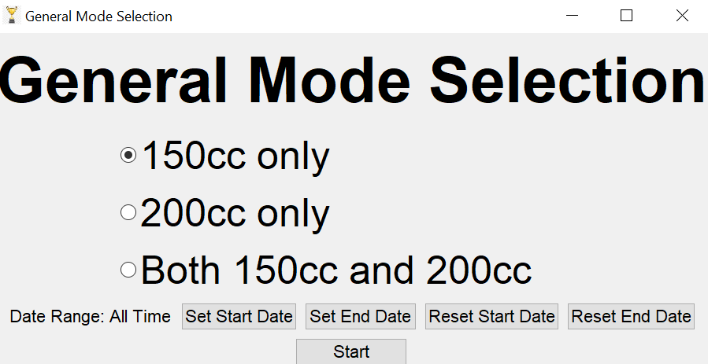

Here, there are 3 general modes:
- **150cc only** - analyse the 150cc records.
- **200cc only** - analyse the 20cc records.
- **Both 150cc and 200cc** - analyse all records regardless of CC.

Again, the date range to analyse can be set, which works in the same way as for course/CC analysis. Refer to the Date Range section of the course/CC analysis section to understand how it works.

Depending on the selected mode and date range, a screen like this should appear:
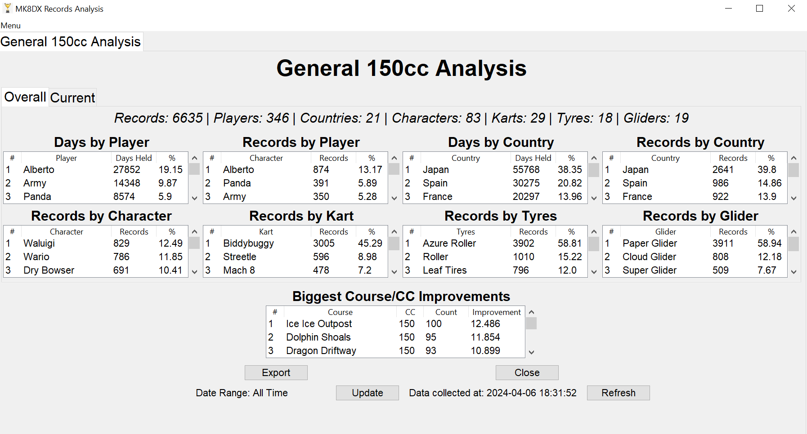

### Analysis Screen
The general analysis screen has the following features:
- Two separate sub-tabs:
    - **Overall** - stats and tables based on all records within in the date range.
    - **Current** - stats and tables based on all **current (active) records**.
- The **same summary stats and tables** as seen in the course/CC analysis screen are evident.
- There is an additional table near the bottom - **Biggest Course/CC Improvements**. This table provides information on the course/CCs with the greatest improvement in finish time within the date range.
- All the same footer buttons and information as the course/CC screen, except for the fact there are no graphs.

### Exportation
Similarly to course/CC data, general data can also be exported to either tabular or document form. When the 'Export' button is pressed, the following screen appears:
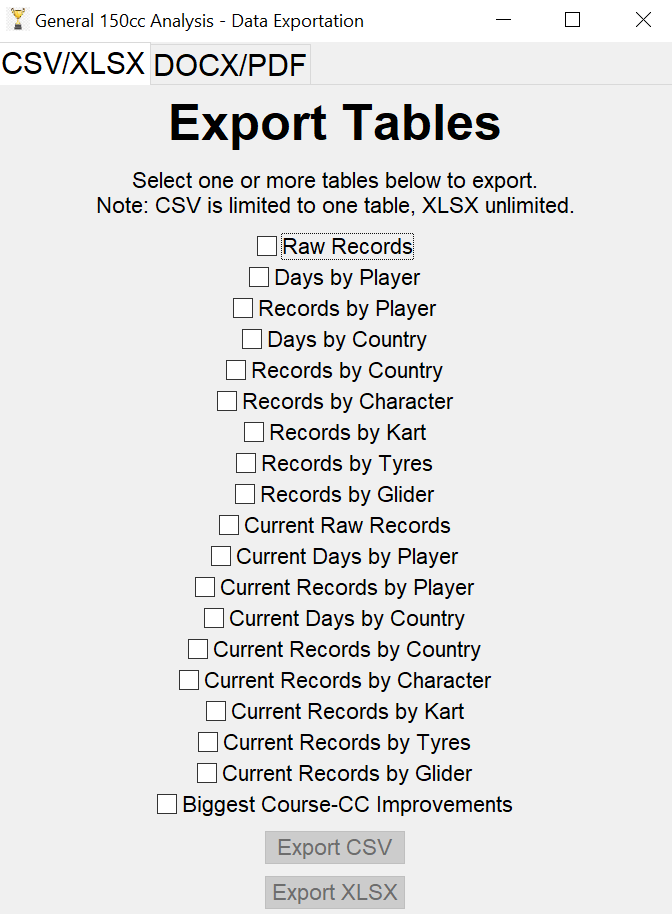

The table export system is very similar to before, with the exception that there are additional tables to export (the current tables based on the current records and the biggest improvements table).

Simply select the desired tables, and export to CSV (1 table only) or XLSX.

The document export tab is as follows:
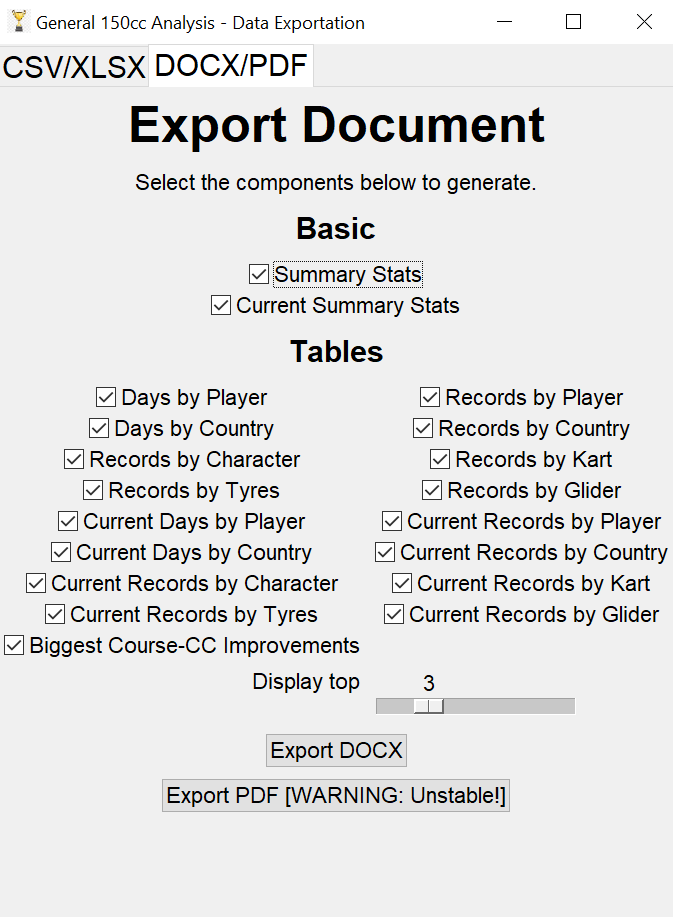

Again, the document export system is very similar to before, except the basic information has summary stats and current summary stats, and there are additional tables and no graphs.

Simply select the desired components to generate and export to DOCX (more stable) or PDF (less stable).

## Known Issues and Limitations
No program is perfect, and this one is not an exception. Below are some known problems with the GUI analysis system, just to ensure transparency:
- PDF exportation, as already mentioned, is unstable.
- The 'Days Lasted' metric beings to break down whenever a **date range** is imposed, since 'Days Lasted' continues to be based on the date the data was collected, not the set end date in the date range. For example, if an active record was set on 2024-01-01, the current date is 2024-02-01 (30 days lasted), and you set the end date to 2024-01-11, days lasted will still be displayed as 30, not 10. This is unfortunate, so be wary of this metric when using a date range.
- The GUI is uninspiring in terms of design. This is not a priority of this program - **functionality is the priority**.
